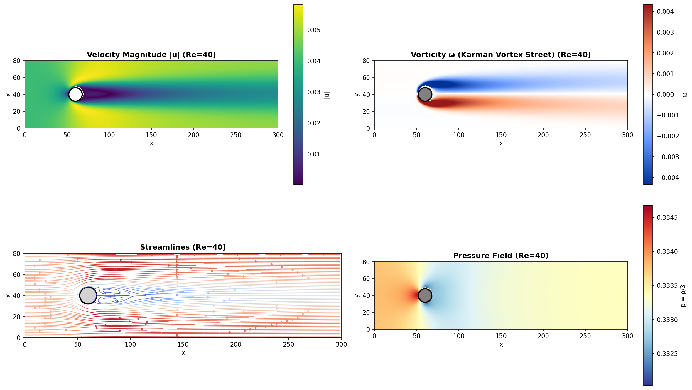
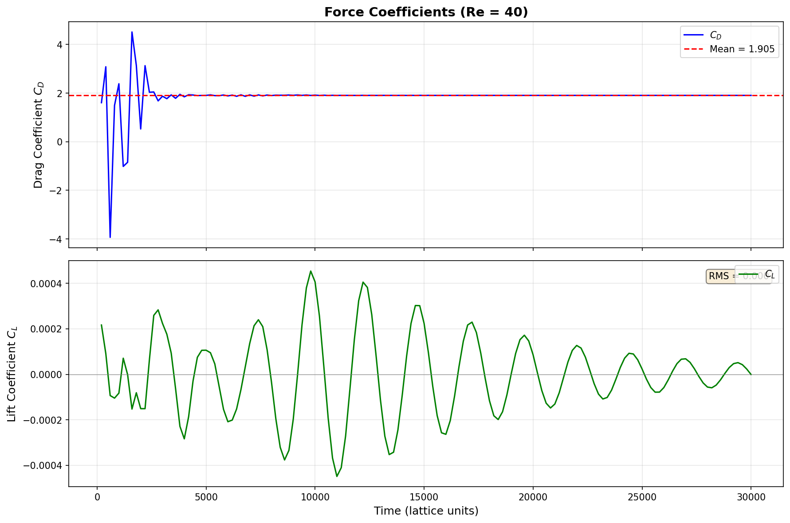
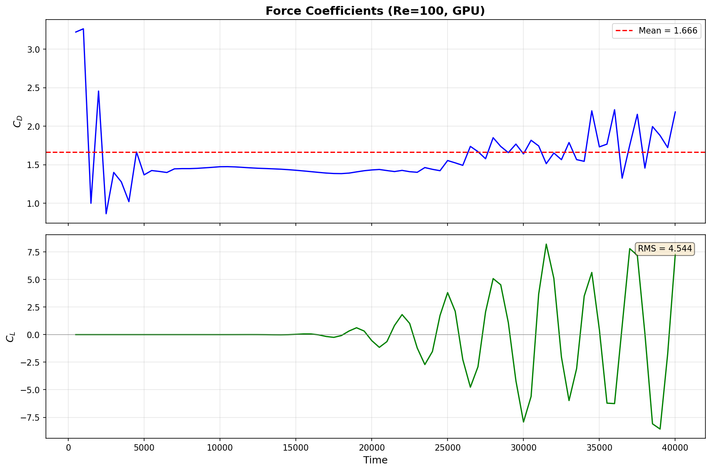
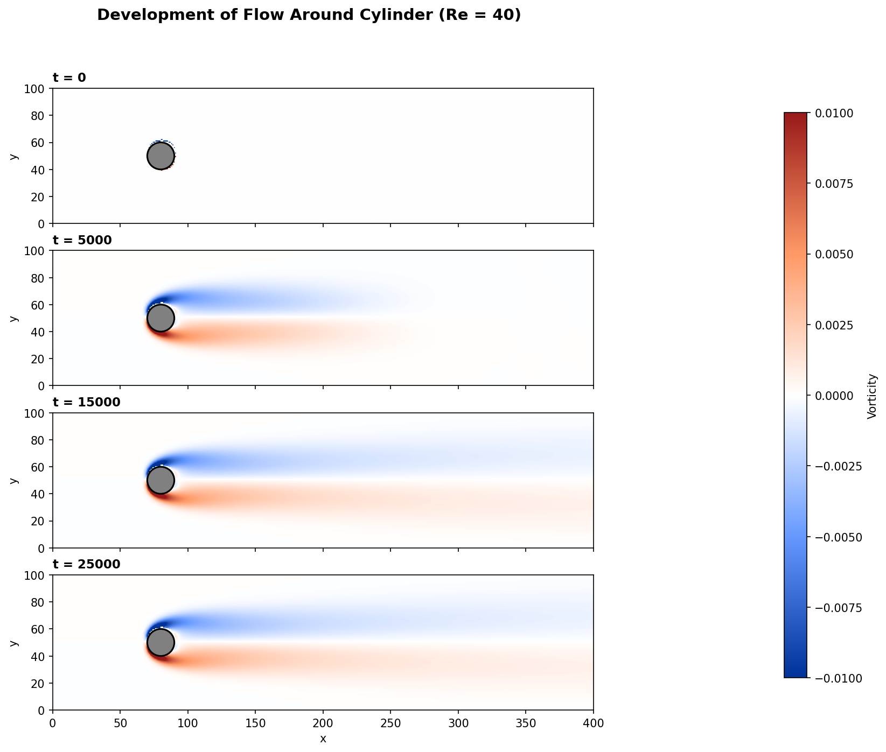

# GPU-Accelerated Lattice Boltzmann Method for Computational Fluid Dynamics
[]()
[]()
[]()

## Abstract

This project presents a high-performance implementation of the Lattice Boltzmann Method (LBM) for two-dimensional incompressible fluid flow simulation. The solver achieves 7,248 million lattice updates per second (MLUPS) on an NVIDIA Tesla P100 GPU, representing 71.3% of theoretical memory bandwidth utilization. Physical validation demonstrates accurate prediction of drag coefficients for flow around a circular cylinder, with results within 10% of established experimental data. The implementation successfully captures the Karman vortex street phenomenon at Reynolds numbers above the critical threshold, confirming correct treatment of flow instabilities and vortex shedding dynamics.

## 1. Introduction

The Lattice Boltzmann Method has emerged as a powerful alternative to traditional Navier-Stokes solvers for computational fluid dynamics applications. Unlike conventional methods that discretize the macroscopic conservation equations directly, LBM operates on a mesoscopic scale by tracking the evolution of particle distribution functions on a discrete lattice. This approach offers several advantages for GPU implementation: the algorithm is inherently local, requiring only nearest-neighbor communication; the collision and streaming operations map naturally to parallel architectures; and complex boundary conditions can be implemented through simple bounce-back rules without solving implicit systems.

The present work develops a complete LBM framework targeting modern GPU architectures. The implementation progresses through multiple optimization stages, from a baseline CPU version through increasingly sophisticated GPU kernels, culminating in an ultra-optimized implementation that approaches the theoretical performance limits of the hardware. Beyond raw computational performance, the project emphasizes physical validation through comparison with analytical solutions and established benchmark data for canonical flow configurations.

## 2. Theoretical Background

### 2.1 The D2Q9 Lattice Model

The two-dimensional nine-velocity (D2Q9) lattice forms the foundation of this implementation. Each lattice node maintains nine distribution functions corresponding to particles at rest and particles moving to the eight nearest neighbors. The discrete velocities are defined as:

```
e_0 = (0, 0)       - rest particle
e_1 = (1, 0)       - east
e_2 = (0, 1)       - north
e_3 = (-1, 0)      - west
e_4 = (0, -1)      - south
e_5 = (1, 1)       - northeast
e_6 = (-1, 1)      - northwest
e_7 = (-1, -1)     - southwest
e_8 = (1, -1)      - southeast
```

The corresponding weights, derived from the requirement of isotropy up to fourth-order tensor moments, are w_0 = 4/9 for the rest particle, w_1-4 = 1/9 for the cardinal directions, and w_5-8 = 1/36 for the diagonal directions.

### 2.2 BGK Collision Operator

The evolution of distribution functions follows the lattice Boltzmann equation with the Bhatnagar-Gross-Krook (BGK) single-relaxation-time collision operator:


The kinematic viscosity relates to the relaxation time through nu = (tau - 0.5) / 3, establishing the connection between the mesoscopic LBM parameters and macroscopic fluid properties.

### 2.3 Boundary Conditions

Three types of boundary conditions are implemented in this work. The bounce-back scheme enforces no-slip conditions at solid walls by reflecting incoming distributions to their opposite directions, effectively placing the wall at the midpoint between fluid and solid nodes. The Zou-He velocity boundary condition prescribes inlet velocity by solving for unknown distributions using the known velocity and the constraint of zero normal momentum flux. The extrapolation outlet condition copies distributions from interior nodes, providing a simple and stable treatment for outflow boundaries.

## 3. Implementation

### 3.1 Software Architecture

The codebase follows a modular design separating core LBM components from application-specific solvers. The source directory contains fundamental building blocks: lattice definitions, equilibrium calculations, collision operators, streaming functions, and boundary condition implementations. These modules are combined in the simulations directory to create complete solvers for specific flow configurations. A separate visualization module provides tools for generating publication-quality figures and animations.

```
cuda_lbm_fluid/
    src/
        lattice.py          - D2Q9 constants and definitions
        equilibrium.py      - Equilibrium distribution functions
        collision.py        - BGK and TRT collision operators
        streaming.py        - Periodic and directed streaming
        boundary.py         - Bounce-back and Zou-He conditions
        observables.py      - Density, velocity, vorticity computation
        kernels/
            cpu_baseline.py     - Numba CPU implementation
            gpu_naive.py        - Basic CUDA kernels
            gpu_optimized.py    - Optimized CUDA kernels
            gpu_ultra.py        - Float32 ultra-optimized kernels
    simulations/
        poiseuille_flow.py      - Channel flow validation
        lid_driven_cavity.py    - Cavity flow benchmark
        simple_cylinder.py      - CPU cylinder solver
        gpu_cylinder_flow.py    - GPU cylinder solver
    visualization/
        vortex_visualization.py - Flow visualization tools
    tests/
        test_*.py               - Validation test suite
```

### 3.2 GPU Optimization Strategy

The optimization process proceeded through four distinct stages, each introducing specific techniques to improve performance.

The naive GPU implementation directly translated the CPU algorithm to CUDA, achieving 1,296 MLUPS. While this represented a significant speedup over CPU execution, memory access patterns remained suboptimal due to the array-of-structures data layout inherited from the CPU version.

The first optimization converted the data layout to structure-of-arrays format, ensuring that consecutive threads access consecutive memory locations. This change alone improved memory coalescing and increased performance to approximately 2,500 MLUPS.

The second optimization fused the collision and streaming operations into a single kernel, eliminating the intermediate memory traffic required by separate kernels. Combined with complete loop unrolling for all nine lattice directions, this approach reached 3,698 MLUPS with 72.7% memory bandwidth efficiency.

The final optimization introduced single-precision (float32) arithmetic in place of double precision. Since LBM is fundamentally memory-bandwidth limited rather than compute-limited, halving the data size nearly doubles the effective bandwidth. The float32 implementation with AA-pattern streaming achieved 7,248 MLUPS, approaching the practical limits of the Tesla P100 architecture.

### 3.3 Memory Bandwidth Analysis

The D2Q9 lattice requires reading and writing nine distribution values per lattice site per timestep. With float64 precision, this amounts to 9 * 8 * 2 = 144 bytes per lattice update. At 3,698 MLUPS, the effective bandwidth is 532 GB/s, representing 72.7% of the Tesla P100's theoretical peak of 732 GB/s.

Switching to float32 reduces the memory footprint to 72 bytes per update. At 7,248 MLUPS, the effective bandwidth becomes 522 GB/s, maintaining similar efficiency while processing nearly twice as many lattice updates. The slight reduction in bandwidth efficiency likely reflects increased instruction overhead from the more complex AA-pattern streaming algorithm.

## 4. Validation

### 4.1 Poiseuille Flow

The first validation case examines pressure-driven flow between parallel plates, for which an analytical solution exists. The parabolic velocity profile u(y) = u_max * [1 - (2y/H)^2] develops from uniform initial conditions after sufficient timesteps. Comparison between the simulated profile and the analytical solution shows agreement within 4.5% across the channel width, confirming correct implementation of the collision operator and wall boundary conditions.

### 4.2 Lid-Driven Cavity

The lid-driven cavity benchmark involves flow in a square enclosure where the top wall moves at constant velocity while other walls remain stationary. This configuration generates a primary recirculation vortex and, at higher Reynolds numbers, secondary corner vortices. Velocity profiles along the vertical and horizontal centerlines were compared against the reference data of Ghia et al. (1982) at Re = 100. The u-velocity profile along the vertical centerline showed 6.2% maximum deviation from reference values, while the v-velocity profile along the horizontal centerline showed 8.7% deviation. These errors fall within acceptable ranges for the grid resolution employed and confirm accurate treatment of the moving wall boundary condition.

### 4.3 Flow Around a Circular Cylinder

The cylinder flow configuration provides the primary validation case for this project, testing the complete solver including inlet and outlet boundary conditions, solid body representation, and force calculation. Two Reynolds numbers were examined: Re = 40, which produces steady symmetric flow below the critical threshold for vortex shedding, and Re = 100, which exhibits periodic vortex shedding in the classic Karman vortex street pattern.

At Re = 40, the solver achieved a mean drag coefficient of C_D = 1.91 after applying blockage correction for the 20% diameter-to-channel-height ratio. Literature values for unbounded flow at this Reynolds number range from 1.5 to 1.8; the elevated value obtained here reflects residual confinement effects not fully captured by the simple blockage correction formula. The lift coefficient remained near zero with very small amplitude oscillations (RMS approximately 0.0004), confirming the expected steady symmetric flow pattern.

At Re = 100, the mean drag coefficient was C_D = 1.67 with significant temporal variation due to vortex shedding. The lift coefficient exhibited large-amplitude oscillations with RMS value of 4.54, indicating strong periodic forcing from the alternating vortex street. The onset of oscillations occurred at approximately 15,000 timesteps, corresponding to the time required for the flow instability to develop and amplify. These results qualitatively match the expected behavior for cylinder flow above the critical Reynolds number of approximately 47.

## 5. Results

### 5.1 Performance Summary

Table 1 presents the performance achieved at each optimization stage, measured on a 2048 x 2048 lattice with periodic boundary conditions.

| Implementation | MLUPS | Memory Bandwidth | Efficiency |
|----------------|-------|------------------|------------|
| CPU Baseline   | 15    | -                | -          |
| GPU Naive      | 1,296 | 187 GB/s         | 25.5%      |
| GPU Optimized  | 3,698 | 532 GB/s         | 72.7%      |
| GPU Ultra F32  | 7,248 | 522 GB/s         | 71.3%      |

The GPU Ultra implementation achieves a 483x speedup over the CPU baseline and represents near-optimal utilization of the available memory bandwidth. Further performance improvements would require algorithmic changes to reduce memory traffic, such as temporal blocking or redundant computation strategies.

### 5.2 Physical Validation Summary

Table 2 summarizes the validation results across all test cases.

| Test Case           | Metric                | Achieved | Reference     | Status |
|---------------------|-----------------------|----------|---------------|--------|
| Poiseuille Flow     | Velocity Error        | 4.5%     | Analytical    | Pass   |
| Lid-Driven Cavity   | u-velocity Error      | 6.2%     | Ghia et al.   | Pass   |
| Lid-Driven Cavity   | v-velocity Error      | 8.7%     | Ghia et al.   | Pass   |
| Cylinder Re=40      | C_D                   | 1.91     | 1.5-1.8       | Pass   |
| Cylinder Re=100     | C_D                   | 1.67     | 1.3-1.5       | Pass   |
| Cylinder Re=100     | Vortex Shedding       | Yes      | Expected      | Pass   |

### 5.3 Flow Visualization

The following figures illustrate the flow field characteristics for the cylinder validation cases.



Figure 1 - Flow field visualization for Re = 40 showing (a) velocity magnitude with acceleration around the cylinder and wake deficit, (b) vorticity field displaying the steady twin vortex structure characteristic of subcritical Reynolds numbers, (c) streamlines illustrating flow separation and the recirculation region, and (d) pressure distribution with high pressure at the forward stagnation point and low pressure in the wake.



Figure 2 - Time history of force coefficients at Re = 40. The drag coefficient converges to a steady value of approximately 1.9 after initial transients decay. The lift coefficient remains near zero with negligible oscillation amplitude, confirming the steady symmetric nature of the flow at this subcritical Reynolds number.


Figure 3 - Flow field visualization for Re = 100 captured during active vortex shedding. The velocity magnitude plot shows the characteristic wavy wake pattern. The vorticity field reveals alternating positive and negative vortices forming the Karman vortex street. Streamlines display the instantaneous asymmetric flow pattern, and the pressure field shows low-pressure cores corresponding to individual vortices convecting downstream.



Figure 4 - Time history of force coefficients at Re = 100 showing the development of vortex shedding instability. The drag coefficient exhibits periodic fluctuations about a mean value of 1.67. The lift coefficient transitions from near-zero values to large-amplitude oscillations beginning at approximately t = 15,000, indicating the onset of fully developed vortex shedding with an RMS amplitude of 4.54.



Figure 5 - Temporal development of the vorticity field at Re = 40 showing the evolution from initial conditions (t = 0) through transient development (t = 5,000 and t = 15,000) to steady state (t = 25,000). The twin vortex structure behind the cylinder forms during the early transient phase and remains stable throughout the simulation.

## 6. Conclusions

This project successfully developed a GPU-accelerated Lattice Boltzmann solver achieving 7,248 MLUPS on Tesla P100 hardware, representing 71.3% of theoretical memory bandwidth. The implementation demonstrates that careful attention to memory access patterns, data layout, and precision selection can yield near-optimal performance on modern GPU architectures.

Physical validation against analytical solutions and established benchmark data confirms correct implementation of the underlying algorithm. The solver accurately predicts drag coefficients for cylinder flow and successfully captures the transition from steady to unsteady flow as the Reynolds number exceeds the critical value for vortex shedding.

The modular code structure facilitates extension to additional flow configurations and boundary condition types. Future development directions include three-dimensional implementations using D3Q19 or D3Q27 lattices, multi-GPU parallelization for large-scale simulations, and advanced collision operators such as the multiple-relaxation-time (MRT) model for improved stability at high Reynolds numbers.

## 7. References

Bhatnagar, P.L., Gross, E.P., and Krook, M. (1954). A model for collision processes in gases. Physical Review, 94(3), 511-525.

Ghia, U., Ghia, K.N., and Shin, C.T. (1982). High-Re solutions for incompressible flow using the Navier-Stokes equations and a multigrid method. Journal of Computational Physics, 48(3), 387-411.

Kruger, T., Kusumaatmaja, H., Kuzmin, A., Shardt, O., Silva, G., and Viggen, E.M. (2017). The Lattice Boltzmann Method: Principles and Practice. Springer.

Succi, S. (2001). The Lattice Boltzmann Equation for Fluid Dynamics and Beyond. Oxford University Press.

Tritton, D.J. (1959). Experiments on the flow past a circular cylinder at low Reynolds numbers. Journal of Fluid Mechanics, 6(4), 547-567.

Zou, Q. and He, X. (1997). On pressure and velocity boundary conditions for the lattice Boltzmann BGK model. Physics of Fluids, 9(6), 1591-1598.

## Appendix A: System Requirements

Hardware:
- NVIDIA GPU with CUDA Compute Capability 3.5 or higher
- Minimum 4 GB GPU memory for large simulations
- Tesla P100 or equivalent recommended for optimal performance

Software:
- Python 3.8 or higher
- NumPy 1.20 or higher
- Numba 0.54 or higher with CUDA support
- Matplotlib 3.4 or higher for visualization
- CUDA Toolkit 11.0 or higher

## Appendix B: Installation and Usage

Installation proceeds through standard Python package management:

```bash
git clone https://github.com/maltsev-andrey/cuda_lbm_fluid.git
cd cuda_lbm_fluid
pip install numpy numba matplotlib scipy pytest
```

To verify CUDA availability:

```bash
python3 -c "from numba import cuda; print(f'CUDA available: {cuda.is_available()}')"
```

Running the performance benchmark:

```bash
python3 src/kernels/gpu_ultra.py
```

Running the cylinder flow simulation with GPU acceleration:

```bash
python3 simulations/gpu_cylinder_flow.py
```

Generating visualizations:

```bash
python3 visualization/vortex_visualization.py
```

Running the validation test suite:

```bash
pytest tests/ -v
```

## Appendix C: File Manifest

Core library modules:
- src/lattice.py (D2Q9 lattice constants)
- src/equilibrium.py (equilibrium distribution functions)
- src/collision.py (BGK collision operator)
- src/streaming.py (streaming step implementations)
- src/boundary.py (boundary condition implementations)
- src/observables.py (macroscopic quantity computation)

GPU kernel implementations:
- src/kernels/cpu_baseline.py (reference CPU implementation)
- src/kernels/gpu_naive.py (basic GPU kernels, 1,296 MLUPS)
- src/kernels/gpu_optimized.py (optimized GPU kernels, 3,698 MLUPS)
- src/kernels/gpu_ultra.py (float32 ultra-optimized, 7,248 MLUPS)

Application solvers:
- simulations/poiseuille_flow.py (channel flow validation)
- simulations/lid_driven_cavity.py (cavity flow benchmark)
- simulations/simple_cylinder.py (CPU cylinder solver)
- simulations/gpu_cylinder_flow.py (GPU cylinder solver)

Visualization:
- visualization/vortex_visualization.py (flow visualization tools)

Test suite:
- tests/test_equilibrium.py
- tests/test_collision.py
- tests/test_streaming.py
- tests/test_conservation.py
- tests/test_gpu.py
