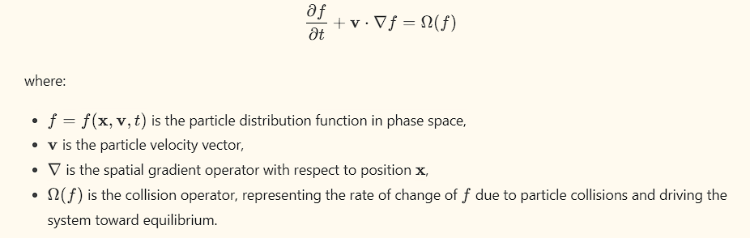

# Theoretical Background
[]()
[]()
[]()

## Overview

This document provides the theoretical foundation for the Lattice Boltzmann Method as implemented in this project. The presentation progresses from the underlying kinetic theory through the discrete lattice formulation to the recovery of macroscopic fluid dynamics, establishing the physical basis for the numerical algorithm.

## Kinetic Theory Foundation

The Lattice Boltzmann Method derives from the kinetic theory of gases, which describes fluid behavior through the statistical mechanics of molecular motion. Rather than tracking individual molecules, kinetic theory works with the particle distribution function f(x, v, t), representing the probability of finding a particle at position x with velocity v at time t.

The evolution of this distribution function follows the Boltzmann equation:


The left side represents free streaming of particles along their velocity characteristics, while the right side Omega(f) is the collision operator describing how particle interactions redistribute momentum and energy. The complexity of the full Boltzmann collision integral makes direct solution computationally prohibitive for most applications.

The connection to fluid dynamics emerges through the moments of the distribution function. The zeroth moment gives density, the first moment gives momentum, and the second moment relates to the stress tensor. The Navier-Stokes equations can be derived from the Boltzmann equation through the Chapman-Enskog expansion, establishing the theoretical link between kinetic and continuum descriptions.

## BGK Approximation

Bhatnagar, Gross, and Krook (1954) introduced a simplified collision operator that replaces the complex integral with a relaxation toward local equilibrium:


This BGK operator drives the distribution toward the Maxwell-Boltzmann equilibrium f_eq on a characteristic timescale tau. Despite its simplicity, the BGK model correctly reproduces the Navier-Stokes equations in the hydrodynamic limit, with the kinematic viscosity related to the relaxation time through:


where c_s is the speed of sound and dt is the timestep. The factor of dt/2 arises from the discretization and represents the difference between pre-collision and post-collision distributions.

## Lattice Discretization

The Lattice Boltzmann Method discretizes both space and velocity. Space is represented by a regular lattice with spacing dx, while the continuous velocity space is replaced by a finite set of discrete velocities chosen to satisfy isotropy requirements.

### The D2Q9 Lattice

For two-dimensional simulations, the D2Q9 model provides nine velocities: one rest velocity and eight velocities pointing to the nearest and next-nearest neighbors. In lattice units where dx = dt = 1, the velocities are:

```
e_0 = (0, 0)      - rest
e_1 = (1, 0)      - east
e_2 = (0, 1)      - north
e_3 = (-1, 0)     - west
e_4 = (0, -1)     - south
e_5 = (1, 1)      - northeast
e_6 = (-1, 1)     - northwest
e_7 = (-1, -1)    - southwest
e_8 = (1, -1)     - southeast
```

Each velocity carries a weight w_i determined by the requirement that the lattice reproduces the correct moment integrals up to a specified order. For D2Q9, the weights are:

```
w_0 = 4/9     (rest particle)
w_1-4 = 1/9  (cardinal directions)
w_5-8 = 1/36 (diagonal directions)
```

These weights ensure that the discrete velocity set correctly represents the Maxwell-Boltzmann distribution through fourth-order tensor moments, which is necessary for recovering the Navier-Stokes equations.

### Equilibrium Distribution

The discrete equilibrium distribution takes the form:


where rho is the density, u is the macroscopic velocity, and c_s = 1/sqrt(3) is the lattice speed of sound. This expression represents the Maxwell-Boltzmann distribution expanded to second order in velocity, sufficient for incompressible flow at low Mach numbers.

The equilibrium satisfies the conservation constraints:


## The Lattice Boltzmann Equation

Combining the BGK collision with lattice discretization yields the lattice Boltzmann equation:


This equation describes a two-step process repeated at each timestep:

1. Collision: The distribution relaxes toward equilibrium according to the BGK operator. This step is purely local, requiring only data from the current node.

2. Streaming: The post-collision distributions propagate to neighboring nodes according to their velocities. This step involves data exchange between adjacent nodes.

The separation of collision and streaming makes LBM well-suited for parallel implementation. Collision requires no communication and can proceed independently at each node. Streaming requires only nearest-neighbor data exchange with a fixed, regular pattern.

## Recovery of Navier-Stokes

The Chapman-Enskog analysis demonstrates that the lattice Boltzmann equation reproduces the Navier-Stokes equations in the limit of small Knudsen number (long mean free path relative to flow scales) and low Mach number (flow velocity small relative to sound speed).

Expanding the distribution function as:


and applying the appropriate multi-scale expansion, the zeroth-order terms yield the Euler equations (inviscid flow), while the first-order correction introduces viscous effects with:


The resulting equations are:


with the equation of state p = rho * c_s^2 = rho/3 for the D2Q9 lattice.

## Boundary Conditions

### Bounce-Back

The bounce-back scheme enforces no-slip conditions at solid walls by reversing the direction of distributions that would otherwise enter the solid region:


where i_bar denotes the direction opposite to i, and x_f is a fluid node adjacent to a solid node. This effectively places the wall at the midpoint between fluid and solid nodes, providing second-order accuracy for the wall location.

The physical interpretation is that particles striking the wall reverse their velocity component normal to the wall while the tangential component remains unchanged on average, resulting in zero net velocity at the wall surface.

### Zou-He Boundary Conditions

For open boundaries where velocity or pressure is specified, the Zou-He method provides a systematic approach based on the observation that the known macroscopic quantities constrain the distribution functions.

At a velocity inlet on the left boundary (x = 0), the distributions f_3, f_6, and f_7 are unknown because they would originate from outside the domain. However, the specified velocity u_inlet and the requirement of consistent density provide three constraints:


Solving these equations for the unknown distributions yields:


where rho is determined from the known distributions and the specified velocity.

Pressure boundaries follow a similar derivation with specified density (pressure) instead of velocity.

## Stability Considerations

The BGK collision operator is stable only for tau > 0.5, corresponding to positive viscosity. As tau approaches 0.5, the viscosity approaches zero and numerical instabilities develop. Practical simulations typically require tau > 0.52 for reliable stability.

The Mach number Ma = u/c_s should remain small (typically Ma < 0.1-0.3) to ensure the validity of the incompressible approximation underlying the equilibrium distribution. Higher Mach numbers introduce compressibility errors that manifest as density fluctuations and spurious pressure waves.

The Reynolds number Re = UL/nu determines the flow physics but also affects numerical stability through its relationship to tau. For a given domain size Land velocity U, increasing Re requires decreasing nu and thus tau, eventually approaching the stability limit. Large-scale simulations at high Reynolds numbers require careful parameter selection to balance physical accuracy with numerical stability.

## Force Implementation

External forces such as gravity or pressure gradients can be incorporated through several methods. The simplest approach adds a forcing term to the equilibrium velocity


This shifts the equilibrium distribution to account for acceleration during the collision step. More accurate methods such as the Guo forcing scheme provide second-order accuracy by also modifying the non-equilibrium part of the distribution.

## Multi-Relaxation-Time Extensions

The BGK model uses a single relaxation time for all distribution modes, which couples the viscosity to the bulk viscosity and limits the achievable Reynolds number. The Multi-Relaxation-Time (MRT) approach transforms to moment space where different modes can relax at different rates:


where m is the moment vector, S is a diagonal relaxation matrix, and the transformation between distribution and moment space is performed through a fixed matrix M.

MRT provides independent control over viscous relaxation, bulk viscosity, and higher-order modes affecting stability. This additional flexibility allows stable simulation at higher Reynolds numbers than possible with BGK, at the cost of increased computational complexity.

## Limitations and Applicability

The Lattice Boltzmann Method as implemented here is appropriate for isothermal, incompressible, single-phase flow at low to moderate Reynolds numbers. The method excels at:

- Complex geometries through simple bounce-back boundary conditions
- Parallel implementation due to local collision operations
- Transient flows including vortex shedding and other time-dependent phenomena
- Moderate Reynolds number external and internal flows

The method has limitations for:

- High Mach number compressible flows (requires modified equilibria)
- Very high Reynolds numbers (requires turbulence modeling or very fine grids)
- Multiphase flows (requires additional distribution functions or modified collision)
- Non-isothermal flows (requires thermal distribution function)

Extensions addressing these limitations exist in the literature but are beyond the scope of this implementation.
